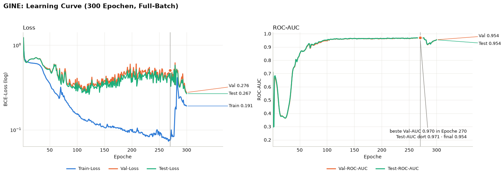
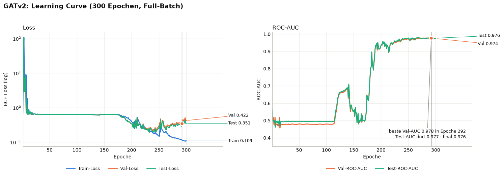
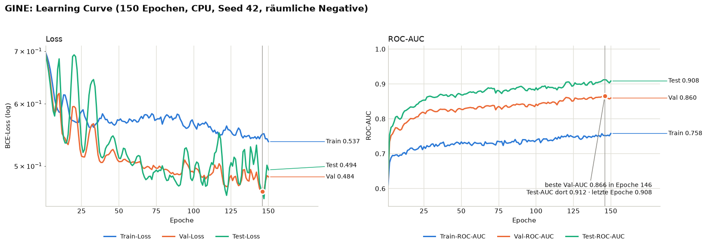
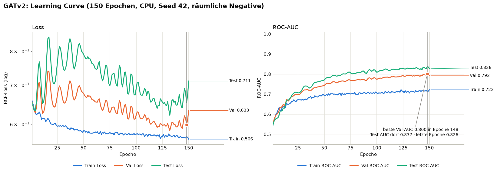

# Überarbeitung der Link-Prediction-Pipeline (GINE vs. GATv2)

Stand: 03.10.2026 · Branch `tom-x-claude-collab` · Ausgangspunkt: Commit `4bbfbda` („Results 17:02“)

## Kurzfassung

- **Die alten Ergebnisse (GINE 0.97, GATv2 0.98 Val-AUC) haben fast nichts über die Modelle ausgesagt.** Die
  zufällig gezogenen Negativ-Paare liegen in der Stadt fast immer weit auseinander. Schon die reine Luftlinie
  zwischen zwei Knoten trennt Links von Nicht-Links mit **AUC 0.998**, ganz ohne Lernen.
- **Die auffälligen Learning Curves hatten konkrete Ursachen im Code.** Der AUC-Einbruch unter 0.5 bei GINE,
  der Loss-Sprung am Ende und das 160-Epochen-Plateau bei GATv2 sind behoben (Abschnitt 2).
- **Der Versuchsaufbau ist jetzt fair.** Train, Val und Test rechnen auf demselben Graphen, keine zu bewertende
  Kante liegt im Graphen, und die Negativ-Paare sind so gezogen, dass weder Entfernung noch Knotengrad allein
  die Aufgabe lösen. Die Learning Curves sind glatt und direkt vergleichbar.
- **Ehrliches Ergebnis:** In diesem fairen Aufbau lernen beide Modelle kaum etwas, das auf Val/Test
  verallgemeinert. Sie liegen **unter** der Luftlinien-Heuristik (≈ 0.72). Abschnitt 4 nennt Möglichkeiten,
  wie es weitergehen kann.

---

## 1. Ergebnisse vorher (Commit `4bbfbda`)

| Modell | Parameter | beste Val-AUC | Test-AUC dort | Test-AUC letzte Epoche |
|---|---|---|---|---|
| GINE | 239.492 | 0.970 (Epoche 270) | 0.971 | 0.954 |
| GATv2 | 36.108.545 | 0.978 (Epoche 292) | 0.977 | 0.976 |

Setup: paarweiser Split (der reziproke Leak war schon behoben), zufällige Negative (2 pro Positivem),
Trainingslabels = Message-Passing-Kanten, Adam mit lr 0.005, kein Weight Decay, 300 Epochen, Full-Batch.

**GINE vorher**

- Epoche 10–30: Die Val-AUC fällt von 0.71 auf **0.37**, also unter Zufall. Das Modell sortiert systematisch
  falsch herum.
- Ab Epoche ~120 öffnet sich die Schere: Train-Loss 0.08, Val-Loss ~0.45.
- Epoche 272–290: Der Train-Loss springt von 0.075 auf 0.24, die AUC fällt auf 0.93. Weil kein Checkpoint
  gespeichert wurde, ist das Endmodell genau dieses „kaputte“ Modell (Test 0.954 statt 0.971).

**GATv2 vorher**

- Epoche 1: Val-Loss **> 100**.
- Epoche 20–115 und 150–175: Der Loss steht exakt bei 0.6365. Das ist die Entropie bei 1/3 Positiven, das
  Modell sagt also nur die Basisrate voraus. Die AUC liegt bei ≈ 0.48. Erst ab Epoche ~175 lernt es.

**Ablation aus dem alten GINE-Notebook** (Einzelläufe, Val-AUC): Kanten roh 0.988, Kanten skaliert 0.974,
ohne Kantenfeatures 0.992, `aggr=mean` 0.985, Dropout 0 0.987, nur Koordinaten-MLP ohne GNN 0.553. „Roh“ und
„skaliert“ hatten praktisch identische Eingaben (die Kanten waren schon skaliert). Der Unterschied von 0.014
ist also reines Rauschen zwischen Läufen, und die anderen Unterschiede liegen in derselben Größenordnung.

---

## 2. Gefundene Fehler und was geändert wurde

### 2.1 Daten

| Problem | Auswirkung | Änderung |
|---|---|---|
| **Zonen-Parser fehlerhaft:** `"Origin       1".split(" ")[1]` ergibt `""`, der Fehler wurde per `except` geschluckt; pro Trips-Zeile wurde nur das erste Ziel erkannt | 1489 statt 1525 Zonen, `node_type` für 36 Knoten falsch (PCA-Färbung, Feature `node_type`) | Zonen laut TNTP-Kopf: Knoten 1..`<NUMBER OF ZONES>`; Knoten- und Kantenzahl werden gegen den Dateikopf geprüft (`parsing.py`) |
| **Platzhalter-Kapazität 999999** der Zonen-Konnektoren dominiert den `StandardScaler` | Alle echten Kapazitäten lagen nach dem Skalieren praktisch auf demselben Wert, `capacity_ratio` bis ~1666 | Platzhalter → 0 (Info steckt in `capacity_is_placeholder`), Verhältnis nur aus echten Kapazitäten, `log1p` vor dem Skalieren (`features.py`) |
| Download des kompletten Repo-ZIPs ohne Timeout | langsam, kann hängen | lädt nur Netz- und Knotendatei, mit Timeout (`download.py`) |

### 2.2 Split und Auswertung (die Hauptursachen)

| Problem | Auswirkung | Änderung |
|---|---|---|
| **Trainingslabels = Message-Passing-Kanten:** Jede Trainingskante lag selbst im Graphen | Abkürzung „ist dst schon mein Nachbar?“, Train-AUC 1.000 vs. Val deutlich niedriger | Ein fester Teil der Train-Paare (30 %) dient nur als Label und fehlt im Graphen, wie `disjoint_train_ratio` bei `RandomLinkSplit` (`graph.py`) |
| **Zu leichte Negative:** zufällige Knotenpaare | Luftlinie allein: AUC 0.998 | Negative unter den 20 räumlich nächsten Knoten |
| **„Loch“-Abkürzung:** Jede entfernte Kante senkt den Grad ihrer Endpunkte | „Niedriger Grad = Link“: AUC ≈ 0.71 ohne Lernen. Auf Train war es umgekehrt (dort lag die Kante im Graphen) → Ursache des AUC-Einbruchs auf 0.37 | Negative mit Loch (`neg_strategy="hole"`): beide Endpunkte stammen aus den Endpunkten der Positiven desselben Splits; Grad-Heuristik danach ≈ 0.53 |
| **Unterschiedlich dichte Graphen:** Train im Training, Val und Test auf verschiedenen Kantenmengen | Reihenfolge Train < Val < Test entsteht allein durch die Dichte; BatchNorm-Statistiken passen nicht → springende Loss-Kurven | **Ein gemeinsamer Message-Passing-Graph** für Train, Val und Test |
| Test-Graph wurde nie benutzt (Doku sagte etwas anderes) | widersprüchlich | entfällt durch den gemeinsamen Graphen; `evaluate_link_predictor(model, split)` rechnet auf dem Graphen des Splits |

### 2.3 Training (`training.py`)

| Problem | Auswirkung | Änderung |
|---|---|---|
| Kein Checkpoint | Endmodell nach dem Loss-Sprung (GINE Test 0.954 statt 0.971); PCA und Test auf dem schlechten Modell | Gewichte der besten Val-Epoche werden gespeichert und am Ende geladen |
| Train-Loss mit Dropout gemessen, Val/Test ohne | Kurven nicht vergleichbar | Alle Kurven im eval-Modus; Loss des Optimierungsschritts separat in `train_loss_step` |
| lr 0.005 konstant, kein Weight Decay, kein Gradient Clipping | Loss-Spikes, zu selbstsichere Logits | lr 0.002 mit 10 Epochen Warmup, `ReduceLROnPlateau` auf der Val-AUC, Weight Decay 5e-4, Gradient Clipping 1.0 |
| Nur `torch.manual_seed`; CUDA-Scatter nicht deterministisch | identisches Setup lieferte 0.974 bzw. 0.988 | `set_seed` (alle RNGs, deterministische Kernels soweit möglich) und `run_seeds`: Auswertung über 5 Seeds (Mittelwert ± Std) |

### 2.4 Modelle (`models.py`, Notebooks)

| Problem | Auswirkung | Änderung |
|---|---|---|
| **GATv2 mit 8 Heads × 512 = 4096 Kanälen, 36 Mio. Parameter**, ohne Normalisierung, ReLU, lr 0.005 | Blowup im ersten Adam-Schritt → tote ReLUs → 160 Epochen Plateau | 4 Heads × 32 = 128 Kanäle, BatchNorm, ELU, Warmup, Clipping (~143k Parameter) |
| **GATv2 sieht mit nur `x, y` fast nichts:** Nachbarn haben fast identische Koordinaten; Kantenfeatures wirken nur auf die Attention-Gewichte; der Grad geht durch Softmax verloren | GATv2 blieb nach dem Verkleinern bei AUC 0.50 | Gemeinsame Eingangsschicht `EdgeAwareInput`: `W_x·x_i + Σ W_e·e_ji`, in **beiden** Modellen |
| `nn.Dropout(0)` im GATv2-Encoder fest verdrahtet | Parameter `dropout` wirkte nur im Decoder | Dropout 0.3 in beiden Encodern |
| Unfairer Vergleich (239k vs. 36 Mio. Parameter, Decoder 128 vs. 512 breit, unterschiedliches Dropout, Notebook behauptete „gleicher Decoder“) | Vergleich nicht aussagekräftig | Gleiche Breite (128), gemeinsamer `LinkDecoder`, gleiche Eingangsschicht und Hyperparameter; nur das Message Passing unterscheidet sich |
| BatchNorm mit Running-Stats | Training und Auswertung normalisierten unterschiedlich → Loss-Sprünge | `batch_norm()` ohne Running-Stats (Full-Batch, gleicher Graph in beiden Modi) |

### 2.5 Notebooks, Doku, Hygiene

- **Falsche Aussagen in den Notebooks korrigiert**, unter anderem:
  - „Loss ≈ 0.69 = ln 2“ (richtig: 0.6365 bei 1:2)
  - „Val-Loss sinkt am Ende noch“ (er stieg)
  - „gleicher Decoder“
  - „kein langes Plateau“
  - ein Verweis auf eine nicht mehr existierende Ablation
  - ein widersprüchlicher Kommentar zu `scale_edge_numerical`
  - „Rohkoordinaten“ (sie werden skaliert)
- **Korrelationsanalyse ersetzt:** Die Korrelation „Kantenfeature ↔ Label“ war konstruktionsbedingt ≈ 0, weil Negative zufällige Features tragen. Sie ist ersetzt durch eine Fehleranalyse nach Link-Typ (`auc_by_link_type`).
- **Temporäre Ablationszelle in GINE** durch eine saubere, optionale Mehr-Seed-Ablation ersetzt (`RUN_ABLATION`).
- **Neu in `data_prep.ipynb`:** Heuristik-Baselines (`evaluation.py`) für alle drei Negativ-Strategien.
- **`.gitignore`** für Rohdaten, `processed/` und Python-Artefakte. `load_bundle` prüft eine Versionsnummer, damit kein veralteter Split unbemerkt geladen wird.

---

## 3. Aktuelle Ergebnisse

### 3.1 Wie schwer ist die Aufgabe ohne Lernen? (`data_prep.ipynb`)

ROC-AUC einfacher Heuristiken auf denselben Label-Paaren (Train / Val / Test):

| Heuristik | zufällige Negative (alt) | räumliche Negative | **Negative mit Loch (aktuell)** |
|---|---|---|---|
| Luftlinie | 0.998 / 0.998 / 0.998 | 0.714 / 0.725 / 0.727 | **0.708 / 0.724 / 0.724** |
| Niedriger Grad („Loch“) | 0.710 / 0.705 / 0.696 | 0.720 / 0.714 / 0.716 | **0.539 / 0.528 / 0.541** |
| Gemeinsame Nachbarn | 0.507 / 0.505 / 0.503 | 0.451 / 0.449 / 0.454 | 0.474 / 0.477 / 0.474 |

Nur mit Loch-Negativen lösen weder Entfernung noch Grad die Aufgabe allein. Die Messlatte für die Modelle ist
die Luftlinie mit ≈ 0.72.

### 3.2 Zwischenstand: räumliche Negative, noch ohne Loch-Ausgleich

Dieser Schritt hat das Grad-Problem sichtbar gemacht (Einzellauf, 150 Epochen, CPU):

| ROC-AUC | Train | Val | Test |
|---|---|---|---|
| Heuristik „niedriger Grad“ | 0.708 | 0.794 | 0.831 |
| GATv2 | 0.722 | 0.792 | 0.826 |
| GINE | 0.758 | 0.866 | 0.912 |

GATv2 hat die Grad-Heuristik fast exakt reproduziert. Die Reihenfolge Train < Val < Test kam allein von den
unterschiedlich dichten Graphen, und die Loss-Kurven sprangen wegen der BatchNorm-Statistiken.

### 3.3 Aktueller fairer Aufbau: Learning Curves aus den Notebooks

<<NOTEBOOK_ERGEBNISSE>>

### 3.4 Experiment: Liegt es am Decoder?

GINE mit anderen Decodern (Einzellauf, 120 Epochen, CPU, Val-AUC der besten Epoche):

| Decoder-Eingabe | Val-AUC | Train-AUC am Ende |
|---|---|---|
| `concat(h_u, h_v)` (aktuell; Probelauf mit 200 Epochen) | 0.529 | 0.652 |
| + `h_u·h_v`, `abs(h_u − h_v)` | 0.554 | 0.850 |
| nur Luftlinie | 0.724 | 0.708 |
| + `h_u·h_v`, `abs(h_u − h_v)` + Luftlinie | 0.673 | 0.905 |

Ein stärkerer Decoder lernt vor allem die Trainingspaare auswendig. Selbst mit der Luftlinie als Feature liegt
das Modell unter der reinen Luftlinie: Die GNN-Embeddings fügen eher Rauschen als Information hinzu. Diese
Varianten sind **nicht** in die Notebooks übernommen.

### 3.5 Einordnung

- Die früheren 0.97–0.98 stammten fast vollständig aus zwei Abkürzungen: Luftlinie (leichte Negative) und
  Löcher im Graphen (Grad).
- Ohne diese Abkürzungen verallgemeinern GINE und GATv2 mit nur `x, y` als Knotenfeature kaum über Zufall
  hinaus. Sie lernen die Trainingspaare auswendig, weil jeder Knoten eindeutige Koordinaten hat.
- Das ist nach unserem Stand kein Programmierfehler, sondern eine Eigenschaft der Aufgabe in diesem Aufbau.
  Die Prüfungen dazu: keine Label-Kante im Graphen, keine Gegenrichtung im Graphen, Basisrate des Loss
  stimmt, Heuristiken plausibel.

---

## 4. Offene Punkte und mögliche nächste Schritte

1. **So berichten.** Sauberer Aufbau und glatte Kurven, mit der Aussage „ohne Abkürzungen schlagen GINE und
   GATv2 die Luftlinie nicht“. Das ist ein legitimes, gut begründbares Ergebnis.
2. **Auswendiglernen verringern und Val verbessern.** Möglich sind ein kleineres Modell, mehr Regularisierung,
   pro Epoche andere Supervision-Kanten (bei gleicher Graphdichte) oder Strukturfeatures ohne Leak (z. B. der
   Grad im Message-Passing-Graphen). Ob das die Luftlinie übertrifft, ist offen.
3. **Leichtere, aber transparente Aufgabe.** `NEG_STRATEGY = "spatial"` in `data_prep.ipynb`: Die
   Grad-Abkürzung wirkt dann wieder (Werte ~0.8–0.87), was im Bericht offen stehen müsste.
4. **Zonen-Konnektoren** (`link_type_7`, Kapazität 999999) sind künstliche Kanten und werden als Ziele
   mitbewertet. Ob man sie ausschließt, ist eine inhaltliche Entscheidung.
5. **Die Notebooks wurden auf CPU ausgeführt.** Auf der GPU können die Zahlen leicht abweichen; maßgeblich
   ist die Mehr-Seed-Auswertung.

## Reproduzieren

1. `data_prep.ipynb` komplett ausführen. Es lädt die Daten und erzeugt `processed/philadelphia_split.pt`.
2. `GINE.ipynb` und `GATV2.ipynb` komplett ausführen. Sie schreiben die Mehr-Seed-Ergebnisse nach
   `processed/seeds_<Modell>.csv`.
3. Ein alter Split wird von `load_bundle` mit einem Hinweis abgelehnt. Dann `data_prep.ipynb` neu ausführen.
